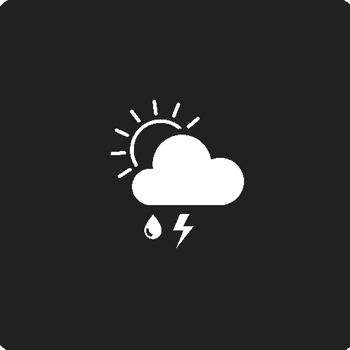

# Pablo's Weather App

A Flutter weather application that displays current weather conditions based on user location or city search styled like GrapheneOS. 

## Features
- Current weather display with temperature, conditions and icon
- "Feels like" temperature indicator
- Humidity and wind speed information
- Search for weather by city name
- Automatic location detection

## Technologies Used
- Flutter
- OpenWeatherMap API
- Geolocator for location services
- HTTP package for API requests

## Setup
1. Clone this repository
2. Create a `.env` file in the root directory with your OpenWeather API key: `OPENWEATHER_API_KEY=your_api_key_here`
3. Run `flutter pub get` to install dependencies
4. Run the app with `flutter run`

## Screenshots

